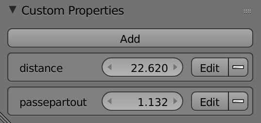
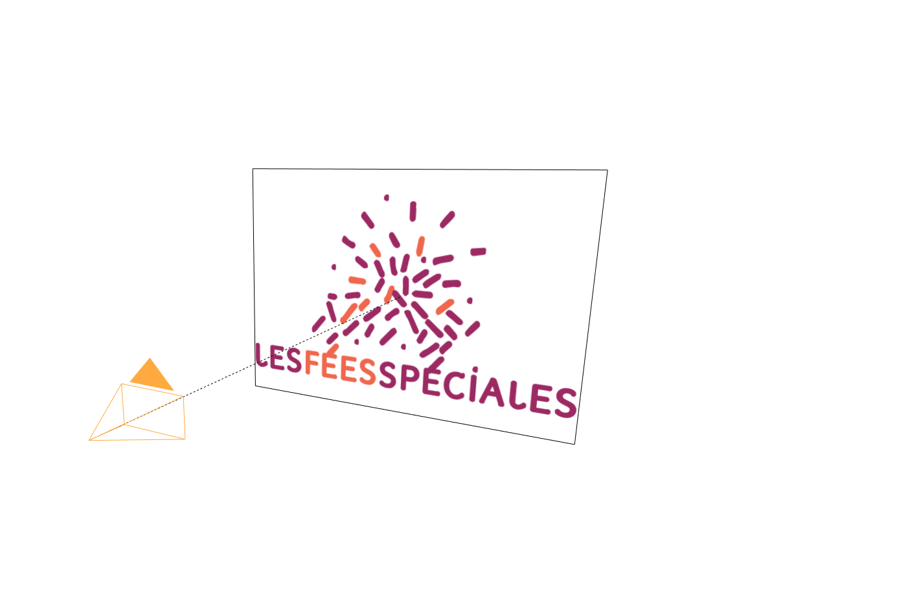
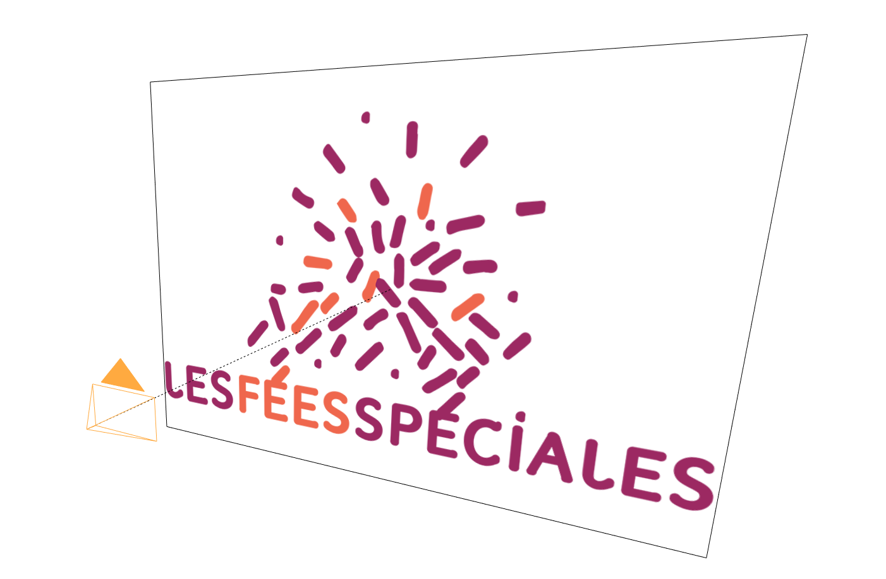
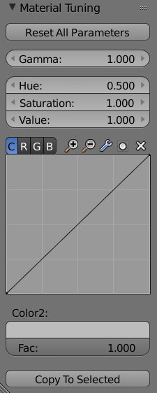
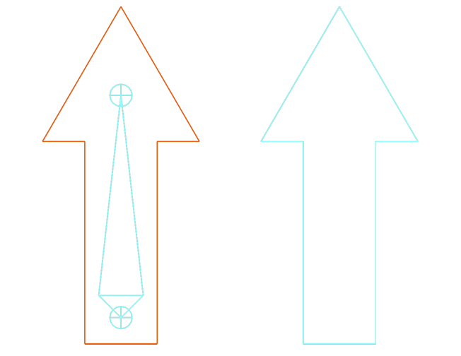
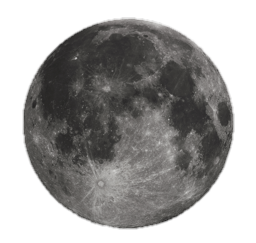
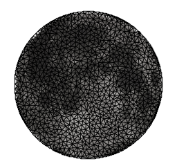

# LFS Blender Scripts

Various Blender scripts, used in production or proof of concepts.

## Table of Contents

* [Files](#files)
  * [Filesize graph](#filesize-graph)
* [Layout](#layout)
  * [Camera plane](#camera-plane)
* [Material](#material)
  * [Material tuning](#material-tuning)
  * [Proxify](#proxify)
* [Rigging](#rigging)
  * [Shape to bone](#shape-to-bone)
  * [Tesselation](#tesselation)
* [Simulation](#simulation)
  * [Particle system template](#particle-system-template)
    * [Fourmis](#fourmis)
* [License](#license)

### Files
#### Filesize graph
This script generates a curve in the 3D view based on a file sequence present in the specified directory. It should be used to monitor image sequence rendering. It allows the user to quickly spot empty images, as well as some artifacts when an image has a different weight from its neighbors.

---
### Layout
#### Camera plane
Import an image and parent it to the camera. You can then set the distance and width from the image object's properties. The plane will adjust to the camera's FOV or focal length.  
You can easily import several images at once, which will be equally spaced in depth. This is useful when creating painted stage-like sets which need to stick to a camera.

  
Two settings are available upon selecting a plane:
* `distance` is the distance from the camera to the plane
* `passepartout` is an additional scale for the plane

  
  
Two focal settings with the same plane.

Please see [this article](http://la-cuisine.les-fees-speciales.coop/2017/10/21/cameraplane-a-tool-for-2d-sets/) for a more in-depth overview of the tool.

---
### Material
#### Material tuning
Change some material properties. Useful for recolorizing textures on multiple objects at the same time (eg. add a globally darker shade to a character in a given shot). Blender Internal only.

Internally, this add-on creates a Blender Internal shading nodetree including several filters, and exposes these filter nodes' interfaces in the Material Panel.

  
The various parameters are simply applied from top to bottom. The `Color2` parameters sets a global hue with a factor.

You can copy the settings from the active object to selected objects.

#### Proxify
Create proxy images to enhance performance in scenes containing a large number of large textures.

---
### Rigging
#### Shape to bone
Transfer a mesh object's shape to the active bone in Pose Mode. Automatically creates a `WGT_` object instance.

  
To apply a shape, select a mesh object, then the armature. In *Pose Mode*, select the bone you wish to apply the shape to. The mesh shape will be transferred to the bone in its current position.

#### Tesselation
Automatically tesselate an image plane for later skinning.  
This add-on requires [scipy](https://www.scipy.org/) and [skimage](http://scikit-image.org/), as well as [triangle](http://dzhelil.info/triangle/), available from the [pypi](https://pypi.python.org/pypi/triangle/). This library needs to be compiled against the same Python version as Blender. In Linux this may involve compiling Python, and a virtual environment. Please contact us for assistance!

   

---
### Simulation
#### Particle system template
An example script to create particle simulations using duplivert instances at each animation frame.

#### Fourmis
French for “ants”. Uses the particle system template to generate an ant colony walking along a specified path using boids.

-----

# License

Blender scripts shared by **Les Fées Spéciales** are, except where otherwise noted, licensed under the GPLv2 license.
